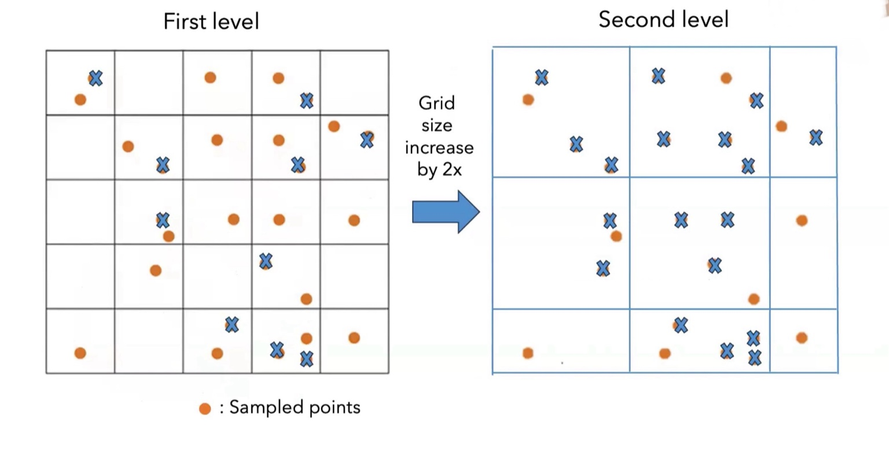

# Class-Aware Grid Subsampling

Efficient point cloud processing often requires downsampling while preserving key features, especially for imbalanced datasets. **Class-Aware Grid Subsampling** introduces a novel, customizable method for subsampling point cloud data, ensuring that minority classes are retained while majority classes are downsampled effectively. This method is particularly useful for semantic segmentation tasks with significant class imbalances.

---

## Key Features

- **Class Balancing**: Retains all points for specified minority classes while applying grid-based sampling to others.
- **Customizable Grid Size**: Define the resolution of the grid for fine-tuned downsampling.
- **Flexible Output Options**: Supports inverse indices, grid coordinates, displacement values, and more.
- **Train-Test Modes**: Tailored subsampling for both training and testing pipelines.
- **Logging Class Distributions**: Logs class-wise point counts before and after subsampling for transparent monitoring.
- **Hash-Based Efficiency**: Utilizes hashing techniques (`FNV` or `ravel`) for fast and unique grid identification.

---

## Grid Sampling Visualization

Below is an example of grid sampling across two levels, where the grid size increases by a factor of 2. Points are sampled to preserve meaningful features, with a focus on class-aware retention.


 )

---

## Installation

1. Clone the repository:
    ```bash
    git clone https://github.com/Mehrdad-Hosseini1992/class-aware-grid-sampling.git
    cd class-aware-grid-sampling
    ```

2. Install dependencies (if required):
    ```bash
    pip install numpy
    ```

---

## Usage

### Basic Example
```python
from grid_sampling import GridSample

# Initialize the subsampling with desired parameters
grid_sampler = GridSample(
    grid_size=0.05, 
    hash_type="fnv", 
    mode="train", 
    keys=("coord", "color", "strength", "segment"),
    return_inverse=True
)

# Input: Dictionary containing point cloud data
data_dict = {
    "coord": coordinates,       # Nx3 array of XYZ coordinates
    "color": colors,            # Nx3 array of RGB values
    "strength": intensities,    # Nx1 array of intensity values
    "segment": labels           # Nx1 array of class labels
}

# Apply class-aware subsampling
subsampled_data = grid_sampler(data_dict)
